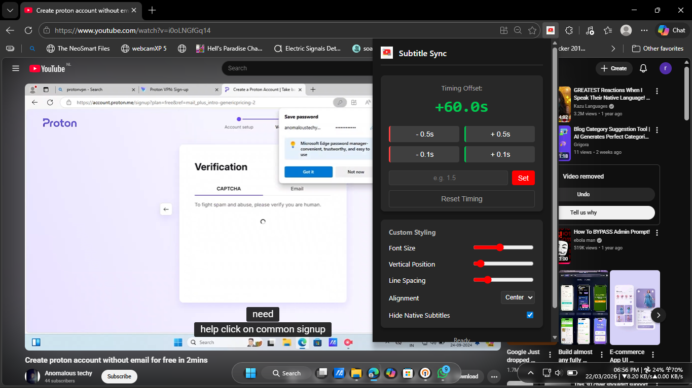
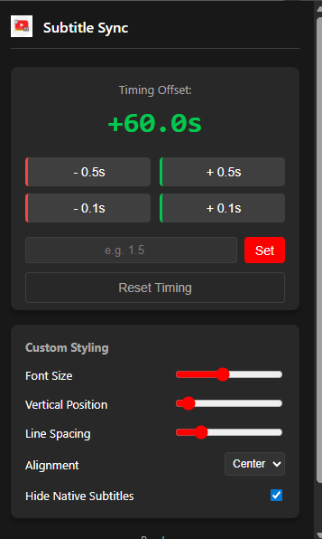
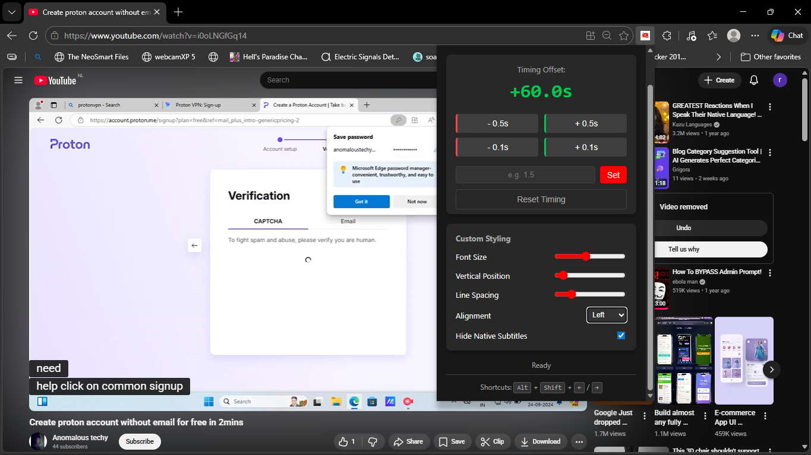
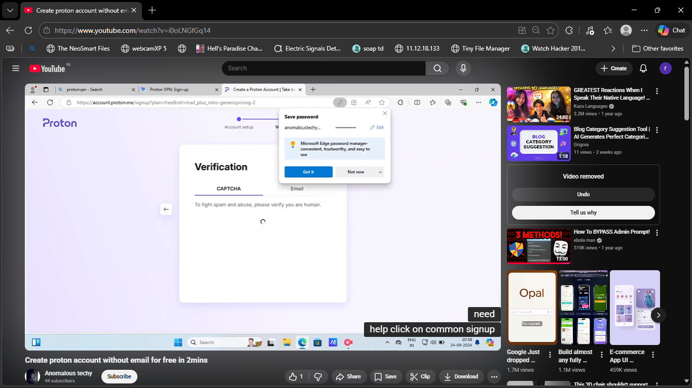

# 🎬 YouTube Subtitle Sync

> Precisely sync YouTube subtitles in real-time — with font controls, keyboard shortcuts, and zero tracking.


---

## ✨ Features

- **Real-time subtitle delay** — Shift subtitles forward or backward with millisecond precision
- **Custom overlay renderer** — Intercepts YouTube's raw `timedtext` JSON and draws a clean custom overlay, bypassing YouTube's native CSS caching entirely
- **Zero-latency adjustments** — Both positive and negative delays work instantly, no page reload needed
- **Keyboard shortcuts** — `Alt+Shift+Left` / `Alt+Shift+Right` for fast timing tweaks
- **Full styling controls** — Font size, line spacing, vertical position, and text alignment
- **Persistent settings** — Remembers your layout preferences and per-video delay via `chrome.storage.local`
- **Native caption suppression** — Aggressively hides YouTube's built-in captions to avoid overlap
- **Sleek dark UI** — Clean popup with ±0.5s / ±0.1s quick buttons and exact delay input

---

## 📸 Screenshots

## Fullscreeenshot


## Popup UI


## Alignment(LEFT)


## Alignment(RIGHT)


---

## 🛠️ Installation (Developer Mode)

Since this extension is not yet on the Chrome Web Store, you can load it manually in seconds.

### Chrome

1. Download or clone this repository
2. Open Chrome and go to `chrome://extensions/`
3. Enable **Developer mode** (toggle in the top right)
4. Click **Load unpacked**
5. Select the root folder of this repository

### Microsoft Edge (Available in Microsoftstore)
1. Download or clone this repository
2. Open Edge and go to `edge://extensions/`
3. Enable **Developer mode** (toggle in the left sidebar)
4. Click **Load unpacked**
5. Select the root folder of this repository

---

## ⌨️ Keyboard Shortcuts

| Shortcut | Action |
|---|---|
| `Alt + Shift + Right` | Delay subtitles by +0.5s |
| `Alt + Shift + Left` | Delay subtitles by −0.5s |

You can customize these shortcuts in Chrome at `chrome://extensions/shortcuts`.

---

## 🎛️ Popup Controls

| Control | Description |
|---|---|
| **± 0.5s / ± 0.1s buttons** | Quick delay adjustments |
| **Custom delay input** | Enter any exact value (e.g. `1.5`, `-0.3`) |
| **Font size slider** | Scale subtitle text up or down |
| **Line spacing slider** | Adjust vertical space between lines |
| **Vertical position slider** | Move the subtitle overlay up or down on screen |
| **Text alignment** | Left / Center / Right |
| **Hide native captions toggle** | Continuously suppresses YouTube's built-in subtitles |

---

## 🔒 Privacy & Security

This extension is designed with privacy as a core principle:

- ✅ **No API keys** — Does not connect to any external service
- ✅ **No tracking** — Zero analytics, telemetry, or usage data collected
- ✅ **Local only** — All processing and storage happens in your browser
- ✅ **Open source** — Every line of code is visible and auditable
- ✅ **Manifest V3** — Built on Chrome's latest, most secure extension standard

---

## 🧠 How It Works

YouTube's native subtitle system is notoriously difficult to manipulate — the player aggressively re-applies its own CSS and caches subtitle timing in memory. This extension takes a different approach:

1. A **content script** intercepts network requests to YouTube's `timedtext` API endpoint
2. The raw subtitle JSON (cue timings + text) is captured before YouTube processes it
3. A **custom overlay** is injected into the page and renders subtitles independently, using `requestAnimationFrame` for smooth, accurate timing
4. The user's delay value is applied at render time, making adjustments instantaneous

This means no fighting with YouTube's DOM — the extension simply ignores it and draws its own subtitles on top.

---

## 📁 Project Structure

```
youtube-subtitle-sync/
├── manifest.json          # Extension manifest (MV3)
├── content.js             # Subtitle interception + overlay renderer
├── popup.html             # Extension popup UI
├── popup.js               # Popup logic and controls
├── background.js          # Service worker (if applicable)
├── icons/                 # Extension icons (16, 48, 128px)
└── README.md
```

---

## 🤝 Contributing

Contributions are welcome! If you find a bug or want to suggest a feature:

1. [Open an issue](../../issues) to discuss it first
2. Fork the repo and create a new branch: `git checkout -b feature/my-feature`
3. Make your changes and commit: `git commit -m 'Add my feature'`
4. Push and open a Pull Request

Please keep PRs focused — one feature or fix per PR makes review much easier.

---

## 📋 Roadmap

- [ ] Chrome Web Store release
- [ ] Microsoft Edge Add-ons release
- [ ] Support for multiple subtitle tracks
- [ ] Per-channel saved delay preferences
- [ ] Export/import settings

---

## 📄 License

This project is licensed under the **MIT License** — see the [LICENSE](LICENSE) file for details.

---

<p align="center">Made with ☕ for anyone who's ever watched a badly-synced subtitle</p>
